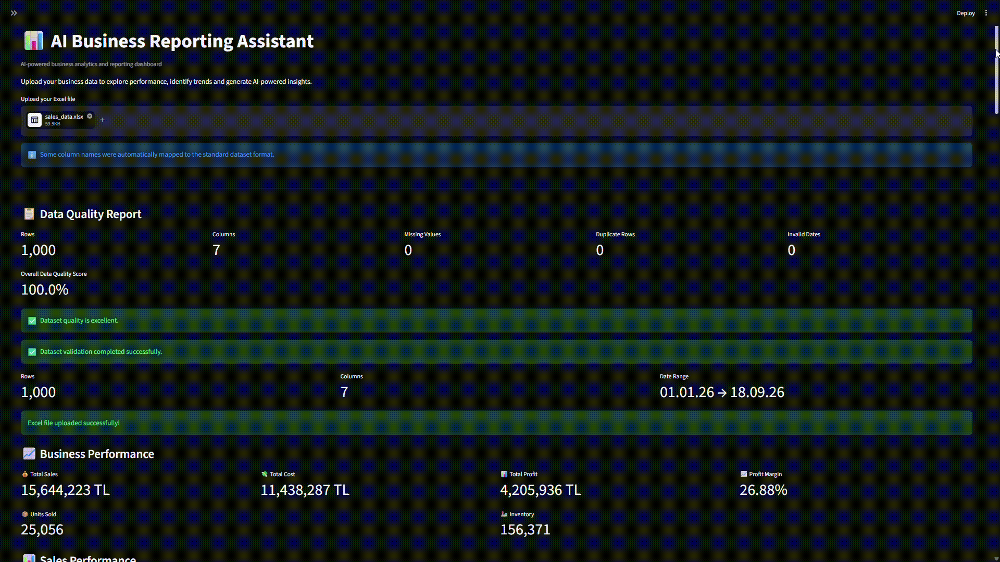
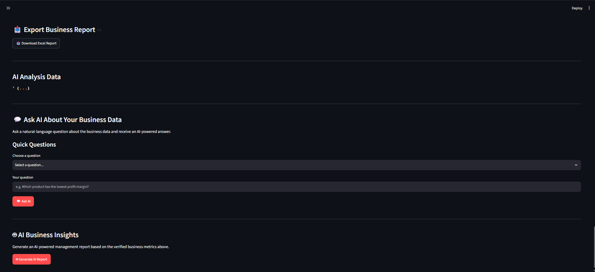

# AI Business Reporting Assistant

An AI-powered business reporting and analytics dashboard that transforms Excel-based business data into interactive insights, data-quality reports, visual analytics, and AI-generated executive recommendations.

## Overview

AI Business Reporting Assistant is a Python-based business analytics application designed to help users quickly understand and report business performance from Excel datasets.

The application automatically validates and standardizes uploaded Excel files, calculates key business metrics, generates interactive visualizations, and uses Google's Gemini API to produce AI-powered business insights.

## Key Features

* Excel file upload and automatic column mapping
* Data validation and data-quality reporting
* Missing-value detection
* Duplicate-row detection
* Invalid-date detection
* Numeric data validation
* Interactive business dashboard
* Department-level sales analysis
* Product-level sales analysis
* Monthly sales and profit analysis
* Inventory analysis
* AI-generated business insights using Gemini
* Key insights, potential risks, possible explanations, and recommended actions
* Excel report export
* KPI Summary sheet
* Monthly Analysis sheet
* Inventory Analysis sheet
* AI Business Insights sheet
* Automatic Excel charts

## Dashboard Preview



## AI Business Insights



## AI Capabilities

The application uses Google's Gemini API to analyze verified business metrics generated from the uploaded dataset.

The AI analysis is structured into:

1. Key Insights
2. Potential Risks
3. Possible Explanations
4. Recommended Actions

The AI is instructed to base its analysis strictly on calculated business metrics and to distinguish potential explanations from verified facts.

## Data Processing Pipeline

```text
Excel Upload
      ↓
Automatic Column Mapping
      ↓
Data Validation
      ↓
Data Quality Analysis
      ↓
Business Metric Calculation
      ↓
Interactive Dashboard
      ↓
Gemini AI Analysis
      ↓
Excel Report Export
```

## Technology Stack

### Programming

* Python

### Data Analysis

* Pandas
* OpenPyXL

### Dashboard & Visualization

* Streamlit
* Plotly

### Artificial Intelligence

* Google Gemini API

### Reporting

* Excel export with OpenPyXL
* Automated Excel charts

## Project Structure

```text
AI-Business-Reporting-Assistant/
│
├── app.py
├── generate_data.py
├── test_gemini.py
├── requirements.txt
├── README.md
├── .env.example
├── .gitignore
│
└── data/
    └── sales_data.xlsx
```

## Installation

Clone the repository:

```bash
git clone https://github.com/Yusuf-l/AI-Business-Reporting-Assistant.git
```

Enter the project directory:

```bash
cd AI-Business-Reporting-Assistant
```

Create a virtual environment:

```bash
python -m venv .venv
```

Activate the virtual environment on Windows:

```bash
.venv\Scripts\activate
```

Install the required dependencies:

```bash
pip install -r requirements.txt
```

## Gemini API Configuration

<<<<<<< HEAD
Create a `.env` file in the project root.

You can use `.env.example` as a template.

On Windows:

```bash
copy .env.example .env

Then open the .env file and replace the placeholder with your own Gemini API key:
=======
The application requires a Gemini API key to use the AI analysis features.

You can use `.env.example` as a template.

On Windows, create your `.env` file by running:

```bash
copy .env.example .env
```

Then open the `.env` file and replace the placeholder with your own Gemini API key:
>>>>>>> a5f4ddc (Improve project documentation)

GEMINI_API_KEY=YOUR_API_KEY

Do not commit your `.env` file to GitHub.

The `.gitignore` file excludes `.env` from version control.

## Running the Application

Start the Streamlit application:

```bash
streamlit run app.py
```

The application will open in your browser.

## Example Workflow

1. Upload an Excel business dataset.
2. The application automatically maps supported column names to the standard dataset format.
3. Data quality and validation checks are performed.
4. Business KPIs and visualizations are generated.
5. Gemini analyzes the verified business metrics.
6. The user can download a structured Excel business report containing the calculated analyses and AI-generated insights.

## Example Report Structure

The generated Excel report contains:

```text
KPI Summary
Dataset
Department Analysis
Product Analysis
Monthly Analysis
Inventory Analysis
AI Business Insights
```

The report also includes automatically generated Excel charts for selected business analyses.

## Data Validation

The application performs several validation checks before generating business insights:

* Missing required columns
* Missing values
* Invalid dates
* Non-numeric values in numeric columns
* Duplicate rows
* Supported column-name variations

This helps ensure that the AI analysis is based on validated business metrics rather than raw, unchecked input data.

## Future Improvements

Possible future improvements include:

* Automated PDF report generation
* More advanced forecasting
* Natural-language data querying
* Additional business KPIs
* Role-based dashboards
* Automated scheduled reporting
* Integration with enterprise data sources

## Author

**Yusuf-l**

Electrical & Electronics Engineering Student

Interested in embedded systems, electronics hardware design, AI-assisted analytics, and R&D.

## License

This project is intended as a personal portfolio and educational project.
